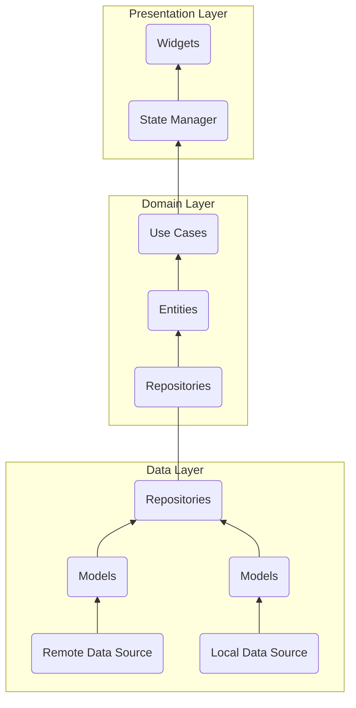

# Архитектура Flutter приложения

## Чистая архитектура

В среде разработчиков на Flutter популярны идеи Чистой Архитектуры (Clean Architecture).

Обычно используют разделение на три основных слоя: 
- Слой данных (Data Layout)
- Доменный слой (Domain Layout)
- Презентационный слой (Presentation Layout)

Слои делятся ещё на несколько частей. Их зависимости строго направлены.

Изобразить данную архитектуру можно в виде схемы. Стрелка указывает направление зависимости, читается как "зависит от", указывает что куда внедряется.

Например, начало следующей диаграммы читается как `Widgets` зависят от `State Manager`.  Или `StateManager` внедряется в `Widgets`, отсюда направление стрелки.



Ошибка многих, считать архитектурой структуру и имена директорий. Архитектура это в первую очередь разделение на слои и связанность зависимостей. Поэтому следующие директории не следует воспринимать буквально. Называться и располагаться может всё иначе.

Директории типового проекта: 

```
lib
├── core
│   ├── platform
│   └── failures
├── features
│	└── {feature_name}
│       ├── data             ─┐
│       │   ├── data_sources  │  Слой
│       │   ├── models        │  данных
│       │   └── repositories ─┘
│       ├── domain           ─┐
│       │   ├── entities      │  Доменный
│       │   ├── repositories  │  слой
│       │   └── use_cases    ─┘
│       └── presentation     ─┐
│           ├── blocs         │  Презентационный
│           ├── pages         │  слой
│           └── widgets      ─┘
├── shared
│   ├── utils
│   │   ├── date
│   │   ├── color
│   │   └── text
│   └── widgets
├── main.dart
├── app.dart
├── theme.dart
├── routes.dart
└── service_locator.dart
```

## Core `/core`

Не относится к слоям чистой архитектуры. Здесь собирается общий код касающийся конкретного проекта и который может использоваться на любом из слоёв. Например, платформенные особенности (`/platform`), классы обработки неудачных кейсов (`/failures`), абстрактные классы задающие контракты (например, контракт как вы будете описывать UseCases), обёртки над запросами, конфиги, константы.

## Общие `/shared`

Не относится к слоям чистой архитектуры. Здесь собирается общий код, который потенциально может быть переиспользован в другом проекте, без внесения изменений. Поэтому не должно быть связей с сущностями и бизнес логикой проекта. 
К примеру, это утилиты по работе с датами, текстами и цветами.
Также это могут быть реализации каких-то виджетов, которым не важно в каком проекте находится. К примеру ui-kit.

## Фичи `/features`

Папка с фичами. Обычно одна фича это какая-либо значимая сущность (`User`, `Post`, `Comment`), либо какой-то функционал, который не описать одной утилитой, а скорее представляет из себя целый пакет (`Filter`, `RichEditor`, `Chart`, `Map`).

Фичи могут использовать друг друга (например комментарию `Comment` может пригодится аватар из фичи `User`). Но желательно производить явную инъекцию зависимостей (`DI`,  `Dependency Injection`)  в корне фичи, чтобы понимать от каких фич зависит другая фича.  

Каждая фича разбивается на слои Чистой Архитектуры.

## Слой данных `/data`

```
└── data
    ├── data_sources
    ├── models
    └── repositories
```

Слой через который данные попадают в приложение. Вы получаете данные в совершенно любом виде и приводите их к желаемому (к моделям).

### `/data_sources`

Здесь мы организовываем получаем наших данных. Это могут быть как запросы к API бекенда, так и запросы к локальным хранилищам и прочим способам достать данные.

И обратная ситуация, здесь описано как из нашего приложения отправить данные в необходимое место.

```dart
abstract class TaskDataSource {
  Future<List<TaskModel>> getTaskList({int? page});
}

class TaskDataSourceImpl implements TaskDataSource {
  static final String _baseUrl = 'tasks';
  final http.Client client;

  TaskDataSourceImpl({required this.client});

  @override
  Future<List<TaskModel>> getTaskList({int? page}) async {
    http.Response response = await client.get(
      getApiUri('/$_baseUrl'),
      headers: {...getAuthorizationHeader()},
    );
  
    if (response.statusCode == 200) {
      final Map<String, dynamic> responseBody = json.decode(response.body);
      List<dynamic> jsonList = responseBody['tasks'];
      return jsonList.map((json) => TaskModel.fromJson(json)).toList();
    } else {
      throw ServerException();
    }
  }
}
```

### `/models`

Модели отвечают за то в каком виде данные окажутся в вашем приложении. 
Но так как скорее всего понадобятся преобразования, такие как парсинг и сериализация JSON, имеет смысл сразу приводить данные к нужному типу по контракту описанному в виде сущностей в `/domain/entities`.

Иными словами, будем считать, что модели отвечают за то, как данные из сторонних источников привести в типу необходимому вашему приложению (`fromJson`), а также обратную ситуацию, как из вашего приложения вывести тип совместимый со сторонним источником (`toJson`).

```dart
// Расширяем сущность, методами fromJson и toJson
class TaskModel extends TaskEntity {
  const TaskModel({
    required super.id,
    required super.startAt,
    required super.duration,
  });

  factory TaskModel.fromJson(Map<String, dynamic> json) {
    return TaskModel(
      id: json['id'],
      // Можно приводить к типам удобным нам ...
      startAt: DateTime.parse(json['startAt']),
      duration: Duration(milliseconds: json['duration']),
    );
  }

  Map<String, dynamic> toJson() {
    return {
      'id': id,
      // ... но не забывать об обратном преобразовании
      'startAt': startAt.toIso8601String(),
      'duration': duration.inMilliseconds,
    };
  }
}
```

### `/repositories`

Мы не должны работать напрямую с источниками данных и моделями из других слоев. 
Из других слоёв мы запрашиваем/отправляем данные через репозитории. Они возвращают сущности. Именно сущности, а не модели. Если сущность отличается от модели, мы должны трансформировать модель в сущность.

Репозитории располагаются сразу на двух уровнях. На уровне данных (текущем) у них реализация, а на доменном — контракт (см `/domain/repositories`).

```dart
// /repositories/task_repository_impl.dart

class TaskRepositoryImpl implements TaskRepository {
  final TaskDataSource taskDataSource;

  TaskRepositoryImpl({
    required this.taskDataSource,
  });
  
  @override
  Future<List<TaskEntity>> getTaskList({required int page}) async {
   return await taskDataSource.getTaskList(page: page);
 }
}
```

## Доменный слой `/domain`

```
└── domain
    ├── entities
    ├── repositories 
    └── use_cases
```

### `/entities`

Сущности — какие то значимые единицы данных вашего приложения, которые ложатся на его бизнес логику. Например, если у вас блог, скоре всего у вас будут такие сущности как Посты, Комментарии, Пользователи.

Сущности это контракты описывающие в каком виде вы хотите использовать данные внутри своего приложения. В этом слое нас не интересует каким образом эти данные будут получены, для этого есть слой данных `/data`, где реализовано получение и отправка данных сущностей.

```dart
class TaskEntity {
  final String id;
  final DateTime startAt;
  final Duration duration;

  const TaskEntity({
    required this.id,
    required this.startAt,
    required this.duration,
  });
}
```

### `/repositories`

Выше уже было про репозитории. См `/data/repositories`. Напомню, что они находятся сразу в двух слоях. В данном слое объявляется их контракт.

```dart
abstract class TaskRepository {
  Future<List<TaskEntity>> getTaskList({required int page});
}
```

### `/use-cases`

У нас есть сущности, у нас есть способы получить и отправить данные. Теперь мы можем собирать и соединять их, чтобы решать конкретные задачи для бизнеса.

Use case может быть простейшим, например — "получи список", где мы по сути просто через репозиторий попросим этот список.

А может быть сложным, где потребуется сделать запросы сразу к нескольким репозиториям, передавая данные от одного к другому, попутно что-то сохраняя на сервере или локально.

```dart
class GetTaskListUseCase
  extends UseCase<List<TaskEntity>, GetTaskListParams> {
  final TaskRepository taskRepository;

  GetTaskListUseCase({required this.taskRepository});

  @override
  Future<List<TaskEntity>> call(GetTaskListParams params) async {
    return await taskRepository.getTaskList(page: params.page);
  }
}


class GetTaskListParams {
  final int page;

  GetTaskListParams({required this.page});
}
```

## Слой презентации `/presentation`

```
└── presentation
    ├── blocs
    ├── widgets
    └── pages
```

### `/blocs`

В каждом слое у нас что-то выступает мостиком между слоями. Слой презентации мы свяжем с доменным через менеджер состояний. Во Flutter популярен BLoC.

### `/widgets`

Виджеты которые касаются фичи. 

### `/pages`

Тоже виджеты, но для удобства собраны входные точки на страницы (экраны).

